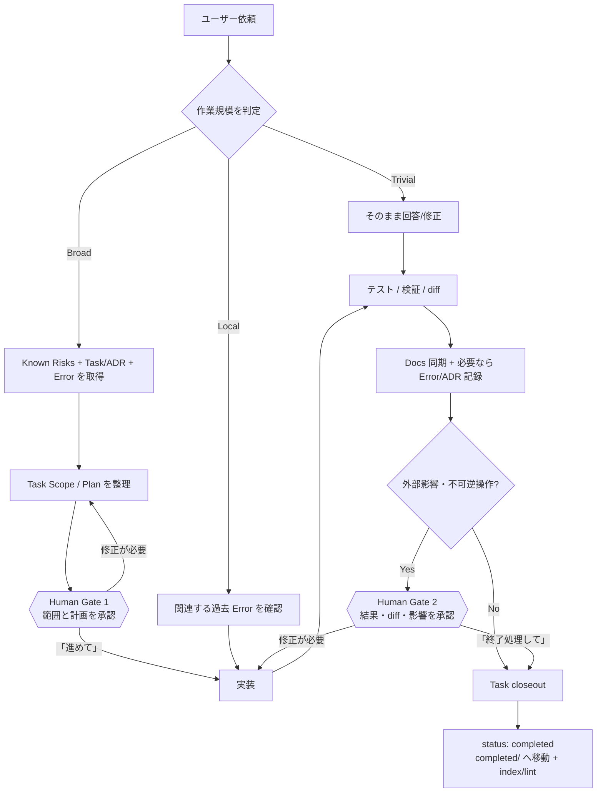

# agent-os — 運用ガイド

**言語:** [English](GUIDE.md) | [한국어](GUIDE.ko.md) | 日本語

一度セットアップした後は普段どおり話せばよい。プロジェクト知識は `.agent-os/` に一つだけ蓄積し、
Claude Code・Codex・ChatGPT は薄いアダプタから同じ記憶を読む。この文書は *運用方法*、
[CONCEPT.ja.md](CONCEPT.ja.md) は *なぜこの構造なのか* を説明する。

---

## 1. ホストアダプタを選ぶ

| ホスト | インストール/入口 | プロジェクト継続ガイダンス | モード |
|---|---|---|---|
| Claude Code | Claude plugin, `/agent-os:init` | root `CLAUDE.md` | local full mode |
| Codex | GitHub Skill/plugin, `$agent-os` | root `AGENTS.md` | Codex/local full mode |
| ChatGPT | インストール済み Skill (`agent-os`) | Skill が主入口。repo の `AGENTS.md` 自動読込を前提にしない | capability 次第 |

通常の ChatGPT GitHub app は read-only。そこでも prior task/error/known-risk の調査と具体的な
変更案の作成はできるが、task 作成・close・commit・push が実際に行われたとは主張しない。
現在の surface に repository write または Codex/Work 相当の実行環境があれば、同じ Skills が
writable mode で動く。

---

## 2. 全体ワークフローを一目で見る

agent-os の目的はすべての作業を重くすることではない。**作業規模に応じて必要な分だけ過去の文脈を取得し、重要な判断点だけ人が承認する**ための仕組みである。



### Human Gate ではこう伝える

**Gate 1 — まだ実装させたくない場合**

```text
agent-os 基準でこの作業をタスク化し、関連する過去記録を確認して Scope と Plan まで作って。まだ実装しないで。
```

計画が良ければ:

```text
OK。この計画どおり進めて。
```

**Gate 2 — 実装後、すぐ close したくない場合**

```text
実装結果、検証結果、変更 diff、残っているリスクを整理して。まだ終了処理しないで。
```

確認後:

```text
問題ない。必要な docs/error/ADR を同期してタスクを終了処理して。
```

小さな変更で毎回この gate を強制する必要はない。Broad 作業、release、削除、migration、戻しにくい変更で特に価値が高い。

---

## 3. プロジェクト初回セットアップ

公開リポジトリ: **https://github.com/blackstrawberry/agent-os**

### Claude Code

そのまま貼り付ける:

```text
/plugin marketplace add blackstrawberry/agent-os
/plugin install agent-os@agent-os
/agent-os:init
```

### Codex

公開 GitHub から agent-os の入口 Skill を直接インストールする。

```text
$skill-installer install https://github.com/blackstrawberry/agent-os/tree/main/skills/agent-os
```

インストール後に Codex を再起動する。新規 project では project scaffold も別途作成する。

```sh
git clone https://github.com/blackstrawberry/agent-os.git ~/.local/share/agent-os
bash ~/.local/share/agent-os/scripts/init.sh /absolute/path/to/your/project
```

既存 project の更新:

```sh
git -C ~/.local/share/agent-os pull --ff-only
bash ~/.local/share/agent-os/scripts/init.sh --update /absolute/path/to/your/project
```

Codex は初期化済み project の root `AGENTS.md` を自動的に読む。Plugins 画面または workspace marketplace で agent-os plugin 全体を使える環境なら、そこからインストールしてもよい。

### ChatGPT

Skills upload が使えるアカウントなら、公開 repository の `skills/agent-os/` folder を一つの Skill として upload する。

- Repository: https://github.com/blackstrawberry/agent-os
- ZIP: https://github.com/blackstrawberry/agent-os/archive/refs/heads/main.zip
- Skill folder: `skills/agent-os/`

workspace 管理者は対応環境で GitHub marketplace を import し、GitHub と同期できる。

### Shell から直接初期化

checkout path が分かっていれば host を問わず:

```sh
bash /path/to/agent-os/scripts/init.sh [--no-eval] /path/to/project
bash /path/to/agent-os/scripts/init.sh --update /path/to/project
```

installer は `.agent-os/` と root `CLAUDE.md`/`AGENTS.md` を作る。両ファイルの agent-os 区間は
一つの canonical protocol から生成され、`--update` は marker 外の既存テキストを保持する。
0.8 より前の Claude-only project には欠けた `AGENTS.md` が追加される。marker が壊れている
場合は片方だけ更新した状態を残さず中断する。

その後:

1. 実 repo を scan して `.agent-os/docs/` Source of Truth を作る
2. 実際に起きた失敗から eval set を作る
3. `git config core.hooksPath .agent-os/scripts/hooks`
4. 新しい machine では `sh .agent-os/scripts/portability-test.sh`
5. project/domain の別名を `.agent-os/vocab.txt` に入れる

---

## 4. Broad タスクを実際に運用する流れ

**ユーザー:** 「詳細ページの売買状態が一覧と違う。合わせて。」

編集前に `07_known-risks.md` を読み、関連 task/ADR と過去 error を探す。shell mode では:

```sh
sh .agent-os/scripts/rank.sh -q "<request words>" -f "<paths>" -n 8
```

上位3件まで開く。shell が無ければ repository search で task/error/ADR frontmatter を探し、
file path と root cause の一致を優先する。search が 0 件でも repository code search が unindexed の可能性があるため、すぐに「過去記録なし」とは判断しない。

**ユーザー:** 「先にタスク化して。」

writable host は `.agent-os/prompts/tasks/NN_slug.md`, `status: planned` を実際に作る。
read-only host は同じ frontmatter/本文案を返し、**書き込んでいないことを明示**する。

> **Human Gate 1 — Scope / Plan 承認**  
> 推奨プロンプト: `タスクと計画まで整理して。実装は確認してから指示する。`

**ユーザー:** 「進めて。」

実装し、検証済みの decision/error を記録し、危険な変更前には prior error を再確認する。

> **Human Gate 2 — Verification / diff 承認**  
> 推奨プロンプト: `検証結果と diff を先に見せて。まだ close しないで。`

**ユーザー:** 「終了処理して。」

writable mode は docs sync → 必要なら error/ADR → `status: completed` → `completed/` 移動 → lint/index 確認。
read-only mode は同じ closeout checklist を提示するだけで、適用したとは言わない。

---

## 5. 何がどの Skill を呼ぶか

| 言い方 | 動くもの |
|---|---|
| 「この repo で agent-os を使って」 | `agent-os` |
| 「タスク化 / 前にやった?」 | `task-scan` |
| 「このミスは前にも?」 | `error-check` |
| 「今のミスを記録」 | `error-log` |
| 「agent-os を初期化/更新」 | `agent-os-init` (Claude: `/agent-os:init`) |
| 「cold memory を整理」 | `agent-os-archive` (Claude: `/agent-os:archive`) |

作業は手順ではなく規模で分ける。trivial は即処理、local は通常 error-check のみ、broad のみ
known-risks + prior task/ADR + error history を先に読む。

---

## 6. Capability mode

**Full mode** — shell + writable files。script/hook/task lifecycle をそのまま実行。

**Repository mode** — repo read/write はあるが shell はない。同じファイルを repository tool で
検索・編集し、実行していない script の結果を捏造しない。

**Read-only mode** — 検索/読取のみ。関連記憶を限定的に取得し、具体的な edit を準備する。
file/status/commit/push が変わったとは言わない。

---

## 7. メモリ保守

`agent-os-health.sh` は read-only。

| 警告 | 対応 |
|---|---|
| docs が index より新しい | `reindex.sh` |
| cold docs / index 予算超過 | archive preview、durable lesson を先に昇格 |
| recurrence 3+ 未昇格 | known-risk または mechanical gate |
| 長期間 open の task | close または blocked 理由を記録 |
| pin 過多 | 永久 load-bearing でないものは外す |
| eval set 空 | 実際の known-answer case を追加 |
| protocol/skill 予算超過 | append し続けず規則を置換 |

古いだけでは cold にならない。archive 後も全文は git history に残る。

---

## 8. 配布検証

plugin maintainer は:

```sh
sh scripts/host-adapter-test.sh
```

canonical/Claude/AGENTS protocol drift、Claude/OpenAI manifest name/version drift、Skill metadata、
fresh init、marker 外テキスト保持、Claude-only migration、malformed marker の fail-closed を検査する。
OS/awk/locale 差は `portability-test.sh` が担当する。

---

## 9. チートシート

| 項目 | 意味 |
|---|---|
| `agent-os` | 共有 protocol/router Skill |
| `agent-os-init` | cross-host init/update |
| `agent-os-archive` | cold memory 管理 |
| `task-scan` | prior task/ADR + task lifecycle |
| `error-check` | 作業前の過去ミス確認 |
| `error-log` | ミス/再発の構造化記録 |
| `CLAUDE.md` | Claude view |
| `AGENTS.md` | Codex view |
| `.agent-os/docs/` | 検証済み Source of Truth |
| `07_known-risks.md` | 罠を規則へ昇格したファイル |
| `rank.sh` | bounded relevance retrieval |
| `host-adapter-test.sh` | host/plugin 配布 gate |
| `portability-test.sh` | machine portability gate |

設計理由は [CONCEPT.ja.md](CONCEPT.ja.md) を参照。
