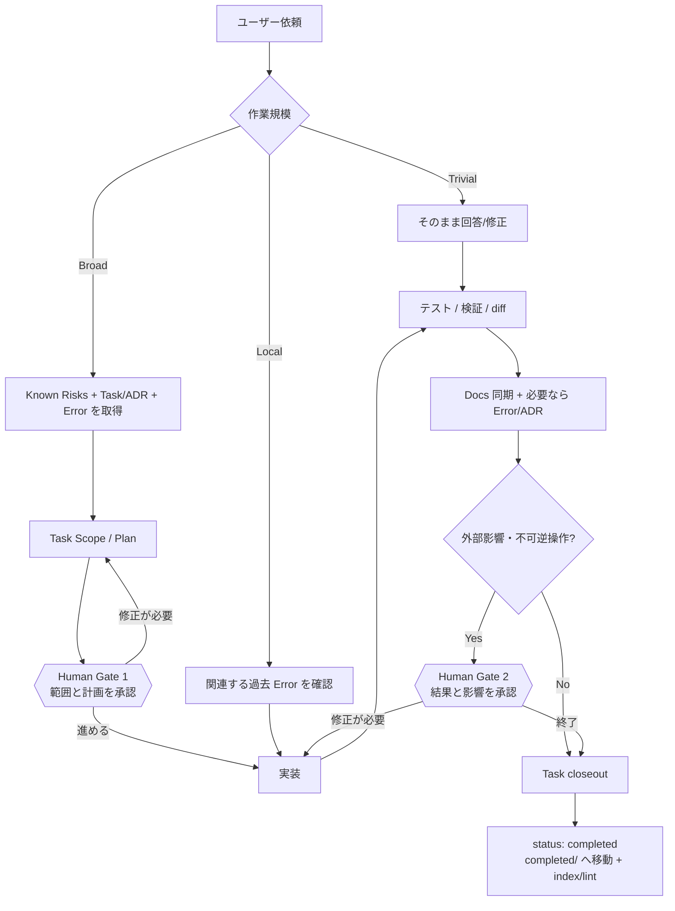

# agent-os — 運用ガイド

**言語:** [English](GUIDE.md) | [한국어](GUIDE.ko.md) | 日本語

一度セットアップした後は普段どおり話せばよい。プロジェクト知識は `.agent-os/` に一つだけ蓄積し、
Claude Code・Codex・ChatGPT は薄いアダプタから同じ記憶を読む。この文書は *運用方法*、
[CONCEPT.ja.md](CONCEPT.ja.md) は *なぜこの構造なのか* を説明する。

---

## 1. Host を選び、ChatGPT では目的から選ぶ

| ホスト | インストール/入口 | 継続ガイダンス | モード |
|---|---|---|---|
| Claude Code | Claude plugin, `/agent-os:init` | root `CLAUDE.md` | local full mode |
| Codex | GitHub Skill/plugin, `$agent-os` | root `AGENTS.md` | Codex/local full mode |
| ChatGPT Native | 現在の surface でインストール可能な plugin/Skill | plugin/Skill | capability 次第 |
| ChatGPT Project compatibility | `chatgpt/agent-os-chatgpt.md` + Project instructions | Project files/instructions | 制限付き compatibility mode |

ChatGPT では capability の前に **利用目的 (intent)** を分ける。

- **個人利用**: 実際に利用可能な Directory plugin → Native Skill → Project compatibility の順で最初に使える経路を選ぶ。
- **workspace/team 配布**: 権限のある admin として marketplace import が使えるかを先に確認し、使えなければ workspace policy が許可する Native Skill/plugin/Project 経路だけを使う。

その後はプラン名ではなく **実際の capability/action/authorization** を見る。GitHub/app/plugin が接続されているというだけで read/write を推測しない。成功した write action が無い限り Task/file/status/commit/push が変わったとは主張しない。

---

## 2. 全体ワークフロー

agent-os は全ての作業を重くする仕組みではない。作業規模に応じて必要な分だけ過去の文脈を取得する。



Gate 1 の例:

```text
agent-os 基準でこの作業をタスク化し、関連する過去記録を確認して Scope と Plan まで作って。まだ実装しないで。
```

Gate 2 の例:

```text
実装結果、検証結果、変更 diff、残っているリスクを整理して。まだ終了処理しないで。
```

---

## 3. 初回セットアップ

公開リポジトリ: **https://github.com/blackstrawberry/agent-os**

### Claude Code

```text
/plugin marketplace add blackstrawberry/agent-os
/plugin install agent-os@agent-os
/agent-os:init
```

最初の smoke:

```text
この repo を変更する前に agent-os で関連する過去記録と known risks を確認して。
```

### Codex

```text
$skill-installer install https://github.com/blackstrawberry/agent-os/tree/main/skills/agent-os
```

Codex を再起動する。新規 project では scaffold も作る。

```sh
git clone https://github.com/blackstrawberry/agent-os.git ~/.local/share/agent-os
bash ~/.local/share/agent-os/scripts/init.sh /absolute/path/to/your/project
```

既存 project の更新:

```sh
git -C ~/.local/share/agent-os pull --ff-only
bash ~/.local/share/agent-os/scripts/init.sh --update /absolute/path/to/your/project
```

Codex は初期化済み project の root `AGENTS.md` を自動的に読む。

### ChatGPT — 個人利用

現在の surface で実際に利用できる最初の経路を使う。

1. **Plugin Directory**: agent-os 自体が一覧にあり Install action がある場合だけインストールする。
2. **Native Skill**: `Plugins -> Skills -> Create -> Upload from your computer` が表示される場合、canonical `skills/agent-os/` をその surface が受け付ける形式でインストールする。
3. **Project compatibility**: native 経路が無く Projects が使える場合:
   - 新しい Project を作る
   - `chatgpt/agent-os-chatgpt.md` を upload
   - `chatgpt/PROJECT_INSTRUCTIONS.md` の内容を Project instructions にコピー
   - 必要なら GitHub/app を接続し、実際に expose された action を確認して read/write を判断する
4. **Projects も無い**: 現在の surface は unsupported。インストール済みのように装わない。

Project compatibility の初期 profile は `agent-os`, `task-scan`, `error-check`, `error-log` のみ。`agent-os-init` と `agent-os-archive` は Project 自体が shell/hooks/local scripts を提供しないため含めない。

Project smoke:

```text
この broad request に agent-os を使って。known risks と最も関連する task/ADR/error を先に確認し、検索 0 件が indexing 問題か不明なら directory/frontmatter fallback を使って。authorized write action が実際に成功していない限り repo を変更したとは言わないで。
```

### ChatGPT — workspace/team 配布

権限のある admin で `Workspace settings -> Plugins -> Add -> Import marketplace` が表示される場合:

1. Source: `https://github.com/blackstrawberry/agent-os`
2. repository root の `.agents/plugins/marketplace.json` を使うため Path は空にする。
3. marketplace を import/sync する。
4. installation policy と provider/app/action 権限は別途設定する。marketplace sync 自体は account access や write permission を付与しない。

admin でない、または import capability が無い場合は workspace policy が許可する Native Skill/plugin/Project 経路だけを使う。全て無ければ unsupported。

現在確認している OpenAI docs:
- Skills: https://help.openai.com/en/articles/20001066-skills-in-chatgpt
- Plugins: https://help.openai.com/en/articles/20001256-plugins-in-chatgpt-and-codex
- GitHub marketplace import: https://help.openai.com/en/articles/20001504-importing-and-syncing-plugin-marketplaces-from-github
- Projects: https://help.openai.com/en/articles/10169521-projects-in-chatgpt

製品 UI/policy は変わり得るため、プラン名を routing key として hard-code しない。

### Shell から直接初期化

```sh
bash /path/to/agent-os/scripts/init.sh [--no-eval] /path/to/project
bash /path/to/agent-os/scripts/init.sh --update /path/to/project
```

`init.sh` は `.agent-os/`, root `CLAUDE.md`, root `AGENTS.md` を一つの canonical protocol から作る。`--update` は marker 外のユーザーテキストを保持し、malformed marker は partial write 前に中断する。

その後、実 repo scan から Source of Truth を作り、実際の失敗から eval set を作成し、`git config core.hooksPath .agent-os/scripts/hooks` を設定し、新しい machine で portability を実行し、`.agent-os/vocab.txt` に project/domain の別名を追加する。

---

## 4. Broad 作業の運用

変更前に `07_known-risks.md` を読み、関連 Task/ADR と過去 Error を探す。shell mode では:

```sh
sh .agent-os/scripts/rank.sh -q "<request words>" -f "<paths>" -n 8
```

上位3件まで開く。shell が無ければ repository tool で task/error/ADR frontmatter を検索し、file path/root cause の一致を優先する。検索 0 件が indexing 問題か区別できなければ E0011 の known-directory + filename/frontmatter/path fallback を使う。

writable host は `.agent-os/prompts/tasks/NN_slug.md` を実際に作る。write action が無い host は正確な path/frontmatter/body を提示するが、書き込んだとは言わない。

実装後、writable mode は docs sync → 必要なら Error/ADR → `status: completed` → `completed/` 移動を行う。non-writable mode は同じ closeout 変更案を提示する。

---

## 5. 何がどの Skill を呼ぶか

| 言い方 | 動くもの |
|---|---|
| 「この repo で agent-os を使って」 | `agent-os` |
| 「タスク化 / 前にやった?」 | `task-scan` |
| 「このミスは前にも?」 | `error-check` |
| 「今のミスを記録」 | `error-log` |
| 「agent-os を初期化/更新」 | `agent-os-init` (Claude: `/agent-os:init`) — local capability が必要 |
| 「cold memory を整理」 | `agent-os-archive` (Claude: `/agent-os:archive`) — local capability が必要 |

---

## 6. Capability mode

**Full mode** — shell + writable files。script/hook/task lifecycle をそのまま実行する。

**Repository mode** — repository tool はあるが shell は無い。現在実際に expose・authorization された read/write action だけを使い、実行できない script の結果を捏造しない。

**Read-only mode** — search/read のみ。関連記憶を限定的に取得し、正確な edit を準備する。file/status/commit/push が変わったとは言わない。

**Project compatibility mode** — Project files/instructions で同じ bounded-memory workflow を route する。shell/hooks/local scripts/repository mutation は別途接続された tool が実際に提供する場合だけ使える。Native Skill parity は主張しない。

---

## 7. メモリ保守

`agent-os-health.sh` は read-only。stale index、cold memory budget、recurrence 3+ の未昇格、長期 open Task、over-pinning、empty eval set、prompt budget drift を確認する。durable lesson を先に昇格してから archive する。

---

## 8. 配布検証

```sh
sh scripts/host-adapter-test.sh
sh scripts/chatgpt-project-test.sh
```

`host-adapter-test.sh` は Task 26 の Claude/Codex baseline を守る: protocol/template drift、plugin name/version、convention hook behavior、Skill metadata、fresh init/update migration、fail-closed host file handling。

`chatgpt-project-test.sh` は Task 27 を検証する: explicit Project allowlist、local-only Skill 除外、deterministic rebuild、tracked artifact drift、public version/source provenance、byte/token budget、private lab leakage、capability guardrail、missing-Skill fail-closed。

`portability-test.sh` は shell/awk/locale portability gate。public release は CORE build 前に二つの distribution fixture を両方実行する。

---

## 9. チートシート

| 項目 | 意味 |
|---|---|
| `agent-os` | 共通 protocol/router Skill |
| `task-scan` | prior Task/ADR + Task lifecycle |
| `error-check` | 作業前の過去 Error 確認 |
| `error-log` | Error/recurrence の構造化記録 |
| `agent-os-init` / `agent-os-archive` | local-capability init/maintenance |
| `CLAUDE.md` / `AGENTS.md` | canonical protocol の Claude/Codex view |
| `chatgpt/agent-os-chatgpt.md` | generated ready-to-upload Project bundle |
| `chatgpt/PROJECT_INSTRUCTIONS.md` | generated Project bootstrap |
| `.agent-os/docs/` | verified Source of Truth |
| `rank.sh` | bounded relevance retrieval |
| `host-adapter-test.sh` | Claude/Codex distribution gate |
| `chatgpt-project-test.sh` | ChatGPT Project distribution gate |

設計理由は [CONCEPT.ja.md](CONCEPT.ja.md) を参照。
