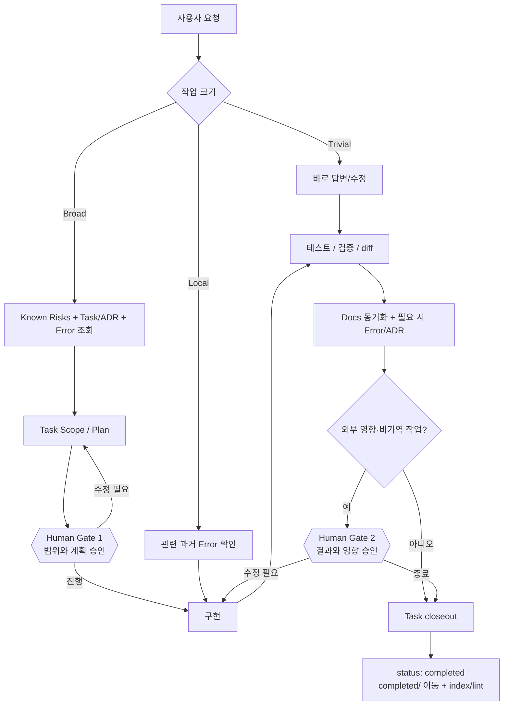

# agent-os — 운영 가이드

**언어:** [English](GUIDE.md) | 한국어 | [日本語](GUIDE.ja.md)

한 번 설정한 뒤에는 평소처럼 말하면 된다. 프로젝트 지식은 `.agent-os/` 하나에 쌓이고,
Claude Code·Codex·ChatGPT는 각자 얇은 어댑터로 같은 메모리를 읽는다. 이 문서는 *운영법*,
[CONCEPT.ko.md](CONCEPT.ko.md)는 *왜 이런 구조인지*를 설명한다.

---

## 1. 호스트를 고르고, ChatGPT라면 목적부터 고른다

| 호스트 | 설치/진입점 | 지속 지침 | 모드 |
|---|---|---|---|
| Claude Code | Claude plugin, `/agent-os:init` | root `CLAUDE.md` | local full mode |
| Codex | GitHub Skill/plugin, `$agent-os` | root `AGENTS.md` | Codex/local full mode |
| ChatGPT Native | 현재 surface에서 설치 가능한 plugin/Skill | plugin/Skill | capability에 따라 다름 |
| ChatGPT Project compatibility | `chatgpt/agent-os-chatgpt.md` + Project instructions | Project 파일/지침 | 제한된 compatibility mode |

ChatGPT는 capability만 보기 전에 **사용 목적(intent)**을 먼저 나눈다.

- **나만 사용**: 실제로 설치 가능한 Directory plugin → Native Skill → Project compatibility 순으로 가능한 첫 경로를 사용한다.
- **workspace/team 배포**: 권한 있는 admin으로 marketplace import가 가능한지 먼저 확인하고, 불가능하면 workspace policy가 허용하는 Native Skill/plugin/Project 경로만 사용한다.

그 다음에는 플랜명이 아니라 **실제 capability/action/authorization**을 본다. GitHub/app/plugin이 연결됐다는 사실만으로 read/write를 추정하지 않는다. 성공한 write action이 없다면 Task/file/status/commit/push가 바뀌었다고 말하지 않는다.

---

## 2. 전체 워크플로우

agent-os는 모든 작업을 무겁게 만드는 도구가 아니다. 작업 크기에 맞는 만큼만 과거 맥락을 불러온다.



Gate 1 예시:

```text
이 작업을 agent-os 기준으로 태스크로 정리하고 관련 과거 기록을 확인한 뒤 Scope와 Plan까지만 작성해줘. 아직 구현하지 마.
```

Gate 2 예시:

```text
구현 결과, 검증 결과, 변경 diff와 남은 리스크를 보여줘. 아직 종료 처리하지 마.
```

---

## 3. 최초 설정

공개 저장소: **https://github.com/blackstrawberry/agent-os**

### Claude Code

```text
/plugin marketplace add blackstrawberry/agent-os
/plugin install agent-os@agent-os
/agent-os:init
```

첫 smoke:

```text
이 repo를 수정하기 전에 agent-os로 관련 과거 기록과 known risks를 확인해줘.
```

### Codex

```text
$skill-installer install https://github.com/blackstrawberry/agent-os/tree/main/skills/agent-os
```

Codex를 재시작한 뒤 새 프로젝트라면 scaffold도 만든다.

```sh
git clone https://github.com/blackstrawberry/agent-os.git ~/.local/share/agent-os
bash ~/.local/share/agent-os/scripts/init.sh /absolute/path/to/your/project
```

기존 프로젝트 업데이트:

```sh
git -C ~/.local/share/agent-os pull --ff-only
bash ~/.local/share/agent-os/scripts/init.sh --update /absolute/path/to/your/project
```

Codex는 초기화된 프로젝트의 root `AGENTS.md`를 자동으로 읽는다.

### ChatGPT — 나만 사용

현재 surface에서 실제 가능한 첫 경로를 사용한다.

1. **Plugin Directory**: agent-os 자체가 실제 목록에 있고 Install action이 있을 때만 설치한다.
2. **Native Skill**: `Plugins -> Skills -> Create -> Upload from your computer`가 보이면 canonical `skills/agent-os/`를 그 surface가 받는 형식으로 설치한다.
3. **Project compatibility**: native 경로가 없고 Projects가 있으면:
   - 새 Project 생성
   - `chatgpt/agent-os-chatgpt.md` 업로드
   - `chatgpt/PROJECT_INSTRUCTIONS.md` 내용을 Project instructions에 복사
   - 필요하면 GitHub/app을 연결하고 실제 expose된 action을 확인한 뒤 read/write 여부 판단
4. **Projects도 없음**: 현재 surface는 unsupported. 설치된 것처럼 흉내 내지 않는다.

Project compatibility의 초기 profile은 `agent-os`, `task-scan`, `error-check`, `error-log`만 포함한다. `agent-os-init`과 `agent-os-archive`는 Project 자체가 shell/hooks/local scripts를 제공하지 않으므로 포함하지 않는다.

Project smoke:

```text
이 broad 요청에 agent-os를 사용해줘. known risks와 가장 관련 높은 task/ADR/error를 먼저 확인하고, 검색 0건이 indexing 문제인지 불명확하면 directory/frontmatter fallback을 사용해. authorized write action이 실제 성공하지 않았다면 repo를 수정했다고 말하지 마.
```

### ChatGPT — workspace/team 배포

권한 있는 admin이고 `Workspace settings -> Plugins -> Add -> Import marketplace`가 보이면:

1. Source: `https://github.com/blackstrawberry/agent-os`
2. repository root의 `.agents/plugins/marketplace.json`을 사용하므로 Path는 비운다.
3. marketplace를 import/sync한다.
4. installation policy와 provider/app/action 권한은 별도로 설정한다. marketplace sync 자체가 계정 접근권한이나 write permission을 부여하지 않는다.

admin이 아니거나 import capability가 없으면 workspace policy가 허용하는 Native Skill/plugin/Project 경로만 쓴다. 모두 없으면 unsupported다.

현재 확인한 OpenAI 문서:
- Skills: https://help.openai.com/en/articles/20001066-skills-in-chatgpt
- Plugins: https://help.openai.com/en/articles/20001256-plugins-in-chatgpt-and-codex
- GitHub marketplace import: https://help.openai.com/en/articles/20001504-importing-and-syncing-plugin-marketplaces-from-github
- Projects: https://help.openai.com/en/articles/10169521-projects-in-chatgpt

제품 UI/정책은 바뀔 수 있으므로 플랜명을 라우팅 키로 hard-code하지 않는다.

### Shell에서 직접 초기화

```sh
bash /path/to/agent-os/scripts/init.sh [--no-eval] /path/to/project
bash /path/to/agent-os/scripts/init.sh --update /path/to/project
```

`init.sh`는 `.agent-os/`, root `CLAUDE.md`, root `AGENTS.md`를 하나의 canonical protocol에서 만든다. `--update`는 marker 밖 사용자 텍스트를 보존하고, malformed marker는 partial write 전에 중단한다.

그 뒤 실제 repo를 스캔해 Source of Truth 작성, 실제 실패로 eval set 작성, `git config core.hooksPath .agent-os/scripts/hooks`, 새 머신에서 portability 실행, `.agent-os/vocab.txt`에 프로젝트 별칭 추가를 한다.

---

## 4. Broad 작업 운영

수정 전에 `07_known-risks.md`를 읽고 관련 Task/ADR와 과거 Error를 찾는다. shell mode에서는:

```sh
sh .agent-os/scripts/rank.sh -q "<요청 단어>" -f "<수정할 경로>" -n 8
```

상위 3건까지만 연다. shell이 없으면 task/error/ADR frontmatter를 repository tool로 찾고 파일 경로/root cause 일치를 우선한다. 검색 0건이 indexing 문제인지 구별할 수 없으면 E0011 방식으로 known directories를 list하고 filename/frontmatter/path로 shortlist한다.

writable host는 `.agent-os/prompts/tasks/NN_slug.md`를 실제 생성한다. write action이 없는 host는 정확한 path/frontmatter/body를 제시하되 작성했다고 말하지 않는다.

구현 후 writable mode는 docs 동기화 → 필요 시 Error/ADR → `status: completed` → `completed/` 이동을 수행한다. non-writable mode는 같은 closeout 변경안을 제시한다.

---

## 5. 어떤 말이 어떤 Skill을 부르나

| 말 | 동작 |
|---|---|
| “이 repo에서 agent-os 써줘” | `agent-os` |
| “태스크로 정리 / 전에 했나?” | `task-scan` |
| “이 실수 전에 했나?” | `error-check` |
| “방금 실수 기록” | `error-log` |
| “agent-os 초기화/업데이트” | `agent-os-init` (Claude: `/agent-os:init`) — local capability 필요 |
| “콜드 메모리 정리” | `agent-os-archive` (Claude: `/agent-os:archive`) — local capability 필요 |

---

## 6. Capability mode

**Full mode** — shell + writable files. script/hook/task lifecycle를 그대로 수행한다.

**Repository mode** — repository tool은 있지만 shell이 없다. 현재 실제 expose·authorization된 read/write action만 사용하고 실행하지 못한 script 결과를 지어내지 않는다.

**Read-only mode** — 검색/읽기만 가능. 관련 메모리를 제한적으로 조회하고 exact edit를 준비한다. file/status/commit/push가 바뀌었다고 말하지 않는다.

**Project compatibility mode** — Project files/instructions로 같은 bounded-memory workflow를 라우팅한다. shell/hooks/local scripts/repository mutation은 별도 연결 도구가 실제 제공할 때만 가능하다. Native Skill parity를 주장하지 않는다.

---

## 7. 메모리 유지보수

`agent-os-health.sh`는 read-only다. stale index, cold memory budget, recurrence 3+ 미승격, 오래 열린 Task, over-pinning, 빈 eval set, prompt budget drift를 본다. durable lesson을 먼저 승격한 뒤 archive한다.

---

## 8. 배포 검증

```sh
sh scripts/host-adapter-test.sh
sh scripts/chatgpt-project-test.sh
```

`host-adapter-test.sh`는 Task 26의 Claude/Codex baseline을 지킨다: protocol/template drift, plugin name/version, convention hook behavior, Skill metadata, fresh init/update migration, fail-closed host file 처리.

`chatgpt-project-test.sh`는 Task 27을 검사한다: explicit Project allowlist, local-only Skill 제외, deterministic rebuild, tracked artifact drift, public version/source provenance, byte/token budget, private lab leakage, capability guardrail, missing-Skill fail-closed.

`portability-test.sh`는 shell/awk/locale 이식성 gate다. public release는 CORE build 전에 두 distribution fixture를 모두 실행한다.

---

## 9. 치트시트

| 항목 | 의미 |
|---|---|
| `agent-os` | 공용 protocol/router Skill |
| `task-scan` | prior Task/ADR + Task lifecycle |
| `error-check` | 작업 전 과거 실수 확인 |
| `error-log` | 실수/재발 구조화 기록 |
| `agent-os-init` / `agent-os-archive` | local-capability init/maintenance |
| `CLAUDE.md` / `AGENTS.md` | canonical protocol의 Claude/Codex view |
| `chatgpt/agent-os-chatgpt.md` | generated ready-to-upload Project bundle |
| `chatgpt/PROJECT_INSTRUCTIONS.md` | generated Project bootstrap |
| `.agent-os/docs/` | 검증된 Source of Truth |
| `rank.sh` | bounded relevance retrieval |
| `host-adapter-test.sh` | Claude/Codex distribution gate |
| `chatgpt-project-test.sh` | ChatGPT Project distribution gate |

설계 이유는 [CONCEPT.ko.md](CONCEPT.ko.md) 참조.
