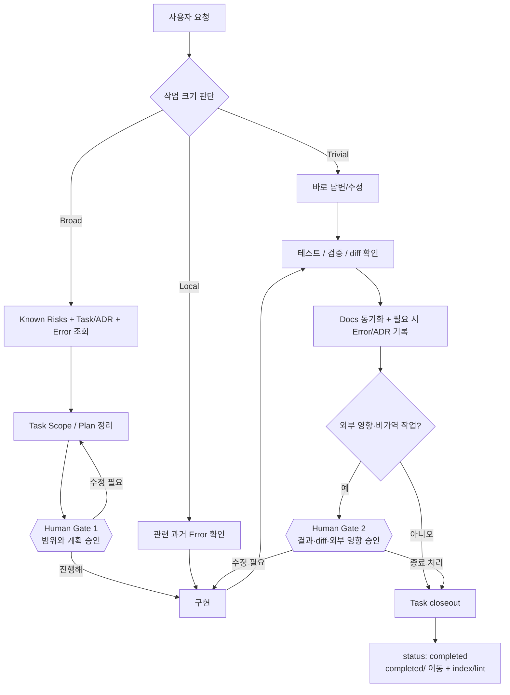

# agent-os — 운영 가이드

**언어:** [English](GUIDE.md) | 한국어 | [日本語](GUIDE.ja.md)

한 번 설정한 뒤에는 평소처럼 말하면 된다. 프로젝트 지식은 `.agent-os/` 하나에 쌓이고,
Claude Code·Codex·ChatGPT는 각자 얇은 어댑터로 같은 메모리를 읽는다. 이 문서는 *운영법*,
[CONCEPT.ko.md](CONCEPT.ko.md)는 *왜 이런 구조인지*를 설명한다.

---

## 1. 호스트 어댑터 선택

| 호스트 | 설치/진입점 | 프로젝트 지속 지침 | 모드 |
|---|---|---|---|
| Claude Code | Claude plugin, `/agent-os:init` | root `CLAUDE.md` | local full mode |
| Codex | GitHub Skill/plugin, `$agent-os` | root `AGENTS.md` | Codex/local full mode |
| ChatGPT | 설치된 Skill (`agent-os`) | Skill이 주 진입점. repo `AGENTS.md` 자동 로드를 전제로 하지 않음 | capability에 따라 다름 |

일반 ChatGPT GitHub app은 read-only다. 이 경우 agent-os는 과거 task/error/known-risk를 조사하고
정확한 수정안을 만들 수 있지만, task 생성·종료·commit·push가 실제로 됐다고 말하면 안 된다.
현재 surface에 repository write 또는 Codex/Work 수준 실행환경이 있으면 같은 Skills가 writable
mode로 동작한다.

---

## 2. 전체 워크플로우 한눈에 보기

agent-os의 목적은 모든 작업을 무겁게 만드는 것이 아니라, **작업 크기에 맞는 만큼만 과거 맥락을 불러오고 사람이 중요한 지점에서만 승인**하게 만드는 것이다.



### Human Gate에서 이렇게 말하면 된다

**Gate 1 — 아직 구현시키고 싶지 않을 때**

```text
이 작업을 agent-os 기준으로 태스크로 정리하고, 관련 과거 기록을 확인한 뒤 Scope와 Plan까지만 작성해줘. 아직 구현하지 마.
```

계획이 괜찮으면:

```text
좋아. 이 계획대로 진행해.
```

**Gate 2 — 구현은 끝났지만 바로 close하고 싶지 않을 때**

```text
구현 결과, 검증 결과, 변경 diff와 남은 리스크를 정리해줘. 아직 종료 처리하지 마.
```

확인 후:

```text
문제없어. 필요한 docs/error/ADR를 동기화하고 태스크 종료 처리해.
```

작은 작업에서는 이 게이트를 매번 강제로 밟을 필요가 없다. 특히 Broad 작업, 외부 배포, 삭제, 마이그레이션, 되돌리기 어려운 변경에서 가장 가치가 크다.

---

## 3. 프로젝트 최초 설정

공개 저장소: **https://github.com/blackstrawberry/agent-os**

### Claude Code

아래를 그대로 붙여넣는다.

```text
/plugin marketplace add blackstrawberry/agent-os
/plugin install agent-os@agent-os
/agent-os:init
```

### Codex

Codex에 agent-os 진입 Skill을 GitHub에서 직접 설치한다.

```text
$skill-installer install https://github.com/blackstrawberry/agent-os/tree/main/skills/agent-os
```

설치 후 Codex를 재시작한다. 새 프로젝트라면 별도로 project scaffold도 만든다.

```sh
git clone https://github.com/blackstrawberry/agent-os.git ~/.local/share/agent-os
bash ~/.local/share/agent-os/scripts/init.sh /absolute/path/to/your/project
```

기존 프로젝트 업데이트:

```sh
git -C ~/.local/share/agent-os pull --ff-only
bash ~/.local/share/agent-os/scripts/init.sh --update /absolute/path/to/your/project
```

Codex는 초기화된 프로젝트의 root `AGENTS.md`를 자동으로 읽는다. Plugins 화면이나 workspace marketplace에서 agent-os 전체 plugin을 설치할 수 있는 환경이면 그 경로를 사용해도 된다.

### ChatGPT

Skills upload가 가능한 계정이라면 공개 저장소의 `skills/agent-os/` 폴더를 Skill로 업로드한다.

- Repository: https://github.com/blackstrawberry/agent-os
- ZIP: https://github.com/blackstrawberry/agent-os/archive/refs/heads/main.zip
- Skill folder: `skills/agent-os/`

workspace 관리자는 지원되는 환경에서 GitHub marketplace를 import해 GitHub와 동기화할 수 있다.

### Shell에서 직접 초기화

호스트와 무관하게 checkout 경로를 알고 있다면:

```sh
bash /path/to/agent-os/scripts/init.sh [--no-eval] /path/to/project
bash /path/to/agent-os/scripts/init.sh --update /path/to/project
```

installer는 `.agent-os/`와 root `CLAUDE.md`/`AGENTS.md`를 만든다. 두 파일의 agent-os 구간은
하나의 canonical protocol에서 나오며, `--update`는 marker 밖 사용자 텍스트를 보존한다.
0.8 이전 Claude-only 프로젝트는 빠진 `AGENTS.md`가 추가된다. marker가 깨져 있으면 한쪽만
업데이트한 상태로 남기지 않고 중단한다.

설정 후:

1. 실제 repo 전체를 스캔해 `.agent-os/docs/` Source of Truth 작성
2. 실제로 물린 사례로 eval set 작성
3. `git config core.hooksPath .agent-os/scripts/hooks`
4. 새 머신에서는 `sh .agent-os/scripts/portability-test.sh`
5. 프로젝트 용어/다국어 별칭을 `.agent-os/vocab.txt`에 추가

---

## 4. Broad 작업을 실제로 운영하는 흐름

**사용자:** “상세 페이지의 매수/매도 상태가 리스트와 다르다. 맞춰줘.”

수정 전에 `07_known-risks.md`를 읽고, 관련 task/ADR와 과거 error를 찾는다. shell mode에서는:

```sh
sh .agent-os/scripts/rank.sh -q "<요청 단어>" -f "<수정할 경로>" -n 8
```

상위 3건까지만 연다. shell이 없으면 repository search로 task/error/ADR frontmatter를 찾고,
파일 경로와 root cause 일치를 우선한다. 검색 결과가 0이어도 repository search가 unindexed일 수 있으므로 곧바로 “과거 기록 없음”으로 결론내리지 않는다.

**사용자:** “태스크부터 만들어줘.”

writable host는 `.agent-os/prompts/tasks/NN_slug.md`, `status: planned`를 실제 생성한다.
read-only host는 동일한 frontmatter/본문 초안을 반환하고 **작성하지 않았다고 명시**한다.

> **Human Gate 1 — Scope / Plan 승인**  
> 추천 프롬프트: `태스크와 계획까지만 정리해. 구현은 내가 확인 후 시킬게.`

**사용자:** “진행해.”

구현하고, 검증된 결정/실수를 기록하고, 위험한 변경 전에는 prior error를 다시 확인한다.

> **Human Gate 2 — Verification / diff 승인**  
> 추천 프롬프트: `검증 결과와 diff를 먼저 보여줘. 아직 close하지 마.`

**사용자:** “종료 처리.”

writable mode는 docs 동기화 → 필요 시 error/ADR 기록 → `status: completed` → `completed/` 이동 → lint/index 확인.
read-only mode는 같은 closeout 체크리스트를 제시하되 적용했다고 말하지 않는다.

---

## 5. 어떤 말이 어떤 Skill을 부르나

| 말 | 동작 |
|---|---|
| “이 repo에서 agent-os 써줘” | `agent-os` |
| “태스크로 정리 / 전에 했나?” | `task-scan` |
| “이 실수 전에 했나?” | `error-check` |
| “방금 실수 기록” | `error-log` |
| “agent-os 초기화/업데이트” | `agent-os-init` (Claude: `/agent-os:init`) |
| “콜드 메모리 정리” | `agent-os-archive` (Claude: `/agent-os:archive`) |

작업은 절차가 아니라 크기로 나눈다. trivial은 바로 처리, local은 보통 error-check만,
broad만 known-risks + prior task/ADR + error history를 먼저 읽는다.

---

## 6. Capability mode

**Full mode** — shell + writable files. script/hook/task lifecycle를 그대로 수행.

**Repository mode** — repo read/write는 있지만 shell 없음. 같은 파일을 repository tool로 검색·수정하며,
실행하지 못한 script 결과를 지어내지 않는다.

**Read-only mode** — 검색/읽기만 가능. 관련 메모리를 제한적으로 조회하고 정확한 수정안을 만든다.
file/status/commit/push가 바뀌었다고 주장하지 않는다.

---

## 7. 메모리 유지보수

`agent-os-health.sh`는 read-only다.

| 경고 | 대응 |
|---|---|
| docs가 index보다 새로움 | `reindex.sh` |
| cold docs / index 예산 초과 | archive preview, durable lesson 먼저 승격 |
| recurrence 3+ 미승격 | known-risk 또는 기계적 gate |
| 오래 열린 task | 종료 또는 blocked 이유 기록 |
| pin 과다 | 영구 load-bearing이 아닌 것은 해제 |
| eval set 비어 있음 | 실제 known-answer 사례 추가 |
| protocol/skill 예산 초과 | 계속 append하지 말고 규칙 교체 |

나이만으로 문서가 cold가 되지는 않는다. archive 후에도 전문은 git history에 남는다.

---

## 8. 배포 검증

plugin 개발자는:

```sh
sh scripts/host-adapter-test.sh
```

검사 대상: canonical/Claude/AGENTS protocol drift, Claude/OpenAI manifest name·version drift,
Skill metadata, fresh init, marker 밖 텍스트 보존, Claude-only migration, malformed marker의
fail-closed. OS/awk/locale 차이는 `portability-test.sh`가 담당한다.

---

## 9. 치트시트

| 항목 | 의미 |
|---|---|
| `agent-os` | 공용 protocol/router Skill |
| `agent-os-init` | cross-host init/update |
| `agent-os-archive` | cold memory 관리 |
| `task-scan` | prior task/ADR + task lifecycle |
| `error-check` | 작업 전 과거 실수 확인 |
| `error-log` | 실수/재발 구조화 기록 |
| `CLAUDE.md` | Claude view |
| `AGENTS.md` | Codex view |
| `.agent-os/docs/` | 검증된 Source of Truth |
| `07_known-risks.md` | 함정을 규칙으로 승격한 파일 |
| `rank.sh` | bounded relevance retrieval |
| `host-adapter-test.sh` | host/plugin 배포 게이트 |
| `portability-test.sh` | 머신 이식성 게이트 |

설계 이유는 [CONCEPT.ko.md](CONCEPT.ko.md) 참조.
