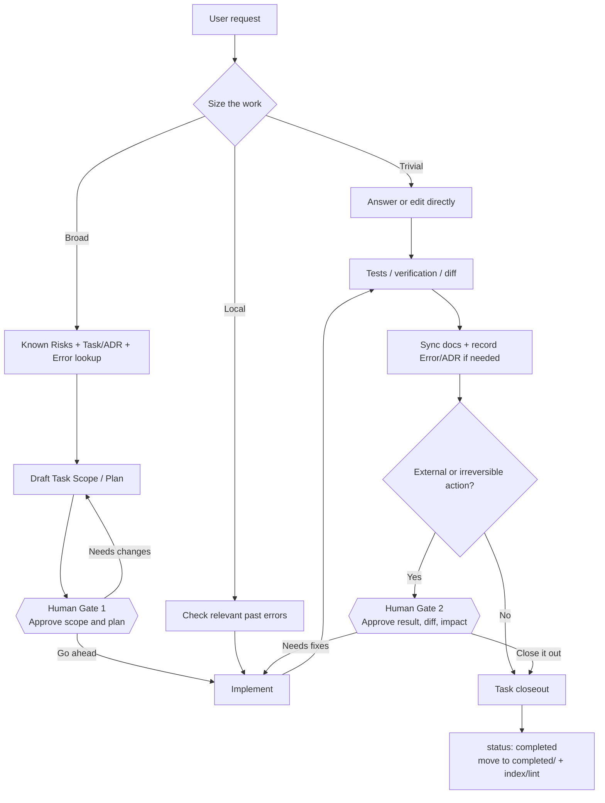

# agent-os — Operating Guide

**Languages:** English | [한국어](GUIDE.ko.md) | [日本語](GUIDE.ja.md)

Set it up once. After that, talk normally and let the repository memory grow instead of rotting.
This guide is *what to do*; [CONCEPT.md](CONCEPT.md) is *why it is built this way*.

---

## 1. Pick the host adapter

The memory model is the same everywhere; only the entry point changes.

| Host | Install / entry | Project guidance | Mode |
|---|---|---|---|
| Claude Code | Claude plugin, `/agent-os:init` | root `CLAUDE.md` | full local mode |
| Codex | GitHub Skill/plugin, `$agent-os` | root `AGENTS.md` | full local/Codex mode |
| ChatGPT | installed Skill such as `agent-os` | Skills are the primary entry; do not assume repo `AGENTS.md` is auto-loaded | capability-dependent |

The ordinary ChatGPT GitHub app is read-only. In that environment agent-os can still search prior
tasks/errors/known-risks and prepare exact changes, but it must not claim a task was created,
closed, committed or pushed. If the active surface exposes repository writes or a full work/Codex
environment, the same Skills can operate in writable mode.

---

## 2. End-to-end workflow at a glance

agent-os is not meant to make every request heavy. It retrieves only as much project memory as the work needs, and asks for human approval at the points where framing or consequences matter.



### Useful prompts at the human gates

**Gate 1 — stop before implementation**

```text
Use agent-os to write this up as a task, inspect related history, and prepare Scope and Plan only. Do not implement yet.
```

If the plan looks right:

```text
Looks good. Proceed with that plan.
```

**Gate 2 — inspect the result before closeout**

```text
Show me the implementation result, verification, diff, and remaining risks. Do not close the task yet.
```

After review:

```text
Looks good. Sync any required docs/error/ADR records and close the task out.
```

You do not need these gates for every tiny change. They matter most for broad work, releases, deletion, migrations, and changes that are hard to reverse.

---

## 3. Setup once per project

Public repository: **https://github.com/blackstrawberry/agent-os**

### Claude Code

Paste these directly into Claude Code:

```text
/plugin marketplace add blackstrawberry/agent-os
/plugin install agent-os@agent-os
/agent-os:init
```

### Codex

Install the public agent-os entry Skill directly from GitHub:

```text
$skill-installer install https://github.com/blackstrawberry/agent-os/tree/main/skills/agent-os
```

Restart Codex after installation. For a new project, create the project scaffold separately:

```sh
git clone https://github.com/blackstrawberry/agent-os.git ~/.local/share/agent-os
bash ~/.local/share/agent-os/scripts/init.sh /absolute/path/to/your/project
```

Update an existing project with:

```sh
git -C ~/.local/share/agent-os pull --ff-only
bash ~/.local/share/agent-os/scripts/init.sh --update /absolute/path/to/your/project
```

Codex automatically reads root `AGENTS.md` in an initialized project. If your Codex Plugins surface or workspace marketplace already exposes the full agent-os plugin, installing it there is also valid.

### ChatGPT

If your account's Skills surface supports uploads, download the public repository and upload the `skills/agent-os/` folder as one Skill.

- Repository: https://github.com/blackstrawberry/agent-os
- ZIP: https://github.com/blackstrawberry/agent-os/archive/refs/heads/main.zip
- Skill folder: `skills/agent-os/`

In a workspace-managed environment, an eligible admin can import the GitHub marketplace and keep it synchronized from GitHub where that product surface supports marketplace import.

### Direct shell installer

If you already have a checkout, the installer works independently of the host:

```sh
bash /path/to/agent-os/scripts/init.sh [--no-eval] /path/to/project
bash /path/to/agent-os/scripts/init.sh --update /path/to/project
```

`init.sh` creates `.agent-os/` plus root `CLAUDE.md` and `AGENTS.md` from one canonical protocol.
`--update` changes only the marked agent-os block and preserves text outside the markers. A
pre-0.8 Claude-only project gets the missing `AGENTS.md`; malformed markers abort before either
host file is partially rewritten.

Then:

1. **Build the source of truth.** Scan the real repo and fill `.agent-os/docs/`. Verify it once yourself; downstream work trusts it.
2. **Fill the eval set** from failures that actually happened in this project.
3. **Turn on the hook**: `git config core.hooksPath .agent-os/scripts/hooks`.
4. **Run portability** on a new machine: `sh .agent-os/scripts/portability-test.sh`.
5. **Seed vocab** with project/domain aliases so cross-language retrieval works.

---

## 4. A normal broad task

**You:** “the detail page shows a different buy/sell status than the list page — make them match.”

Before editing, agent-os reads `07_known-risks.md`, finds related tasks/ADRs, and checks relevant
past errors. In shell mode it uses:

```sh
sh .agent-os/scripts/rank.sh -q "<request words>" -f "<paths you will touch>" -n 8
```

Open at most the top three records. Without shell, use repository search over task/error/ADR
frontmatter and prefer file-path/root-cause hits. A zero search result is not automatically proof of no history when repository code search may be unavailable or unindexed.

**You:** “write it up as a task first.”

A writable host creates `.agent-os/prompts/tasks/NN_slug.md`, `status: planned`, from the template.
A read-only host returns the exact proposed file/frontmatter and says it was not written.

> **Human Gate 1 — approve Scope / Plan**  
> Suggested prompt: `Prepare the task and plan only. I will approve before implementation.`

**You:** “go ahead.”

The agent implements, logs verified decisions/traps, and checks past errors again before risky
steps.

> **Human Gate 2 — approve Verification / diff**  
> Suggested prompt: `Show verification and the diff first. Do not close the task yet.`

**You:** “close it out.”

Writable mode updates docs, records mistakes/decisions if needed, sets `status: completed`, moves
the task to `completed/`, and runs the applicable lint/index gate. Read-only mode returns the same
closeout checklist without pretending it applied it.

---

## 5. What triggers what

| Say something like | Skill / command |
|---|---|
| “use agent-os for this repo” | `agent-os` |
| “write this up as a task” / “did we do this before?” | `task-scan` |
| “have I hit this mistake before?” | `error-check` |
| “log that mistake” | `error-log` |
| “initialize/update agent-os” | `agent-os-init` (Claude compatibility: `/agent-os:init`) |
| “clean up cold memory” | `agent-os-archive` (Claude compatibility: `/agent-os:archive`) |

Work is sized, not marched through. Trivial work is direct; local work normally needs only
`error-check`; broad work runs the full memory lookup.

---

## 6. Capability modes

**Full mode** — shell + writable files. Use scripts, task/error lifecycle, hooks and verification.

**Repository mode** — repository read/write tools, no shell. Search and edit the same files through
repository tools; do not invent results from scripts you could not run.

**Read-only mode** — repository search/read only. Retrieve bounded context and prepare exact edits.
Never say a file/status/commit/push changed.

This capability-first rule is deliberate: product surfaces change more often than the memory
format does.

---

## 7. Memory maintenance

`agent-os-health.sh` is read-only. Pay attention to:

| Warning | Response |
|---|---|
| docs newer than index | run `reindex.sh` |
| cold docs / index over budget | preview `agent-os-archive`; promote durable lessons first |
| recurrence 3+ not promoted | known-risk or mechanical gate |
| stale open tasks | close or document why blocked |
| over-pinning | unpin items that are important but not permanently load-bearing |
| empty eval set | add real known-answer cases |
| prompt budget exceeded | replace rules; do not append forever |

Age alone never makes a document cold. Full text remains in git history after archival.

---

## 8. Distribution verification

Plugin maintainers run:

```sh
sh scripts/host-adapter-test.sh
```

The fixture checks:

- canonical protocol == Claude template == AGENTS template;
- lab root host guidance does not drift;
- Claude/OpenAI plugin name and version match;
- convention hook is not redundantly declared;
- shared Skill metadata exists;
- fresh init creates both host files;
- update preserves text outside markers;
- Claude-only installs gain `AGENTS.md`;
- malformed markers fail closed before partial writes.

`portability-test.sh` remains the machine-level gate for shell/awk/locale behavior.

---

## 9. Cheatsheet

| Thing | What it is |
|---|---|
| `agent-os` | shared protocol/router skill |
| `agent-os-init` | cross-host initialization/update skill |
| `agent-os-archive` | cross-host cold-memory maintenance |
| `task-scan` | related prior work + task lifecycle |
| `error-check` | prior mistakes before work |
| `error-log` | structured mistake/recurrence recording |
| `CLAUDE.md` | Claude Code view of the protocol |
| `AGENTS.md` | Codex view of the same protocol |
| `.agent-os/docs/` | verified source of truth |
| `07_known-risks.md` | durable traps as rules |
| `.agent-os/docs/adr/` | rejected alternatives + revisit conditions |
| `.agent-os/vocab.txt` | cross-language/domain aliases |
| `.agent-os/prompts/index.jsonl` | generated retrieval catalog |
| `rank.sh` | bounded relevance retrieval |
| `agent-os-health.sh` | read-only memory health |
| `host-adapter-test.sh` | distribution/host adapter gate |
| `portability-test.sh` | machine portability gate |

See [CONCEPT.md](CONCEPT.md) for the design rationale.
