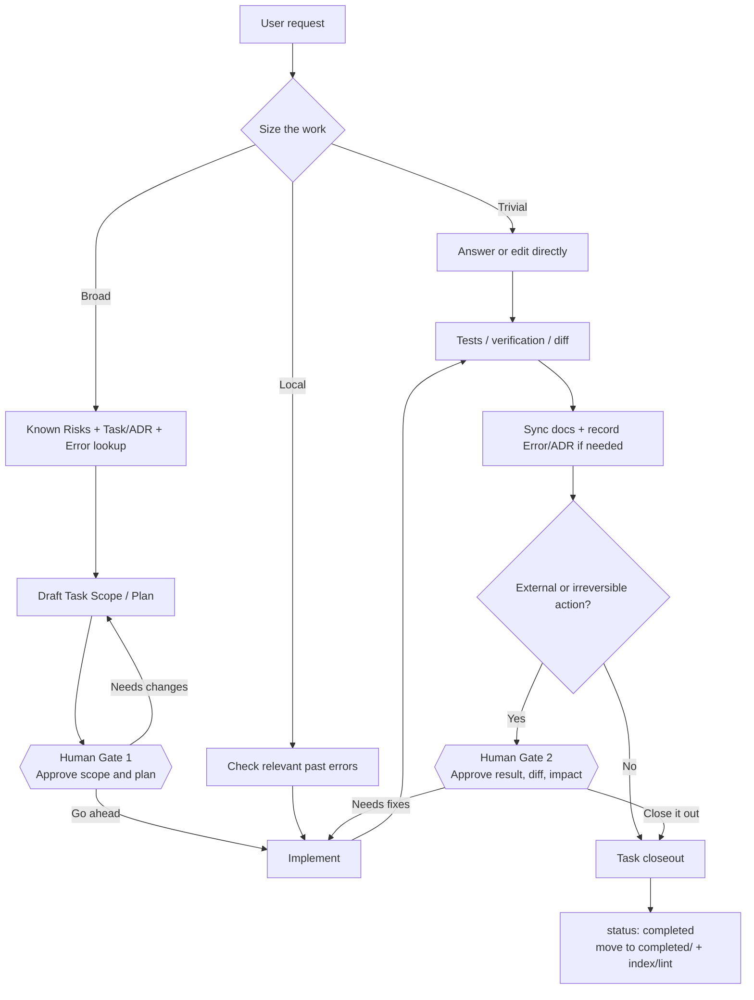

# agent-os — Operating Guide

**Languages:** English | [한국어](GUIDE.ko.md) | [日本語](GUIDE.ja.md)

Set it up once. After that, talk normally and let the repository memory grow instead of rotting.
This guide is *what to do*; [CONCEPT.md](CONCEPT.md) is *why it is built this way*.

---

## 1. Pick the host, then the installation intent

The memory model is the same everywhere; only the entry point and available actions change.

| Host | Install / entry | Persistent guidance | Mode |
|---|---|---|---|
| Claude Code | Claude plugin, `/agent-os:init` | root `CLAUDE.md` | full local mode |
| Codex | GitHub Skill/plugin, `$agent-os` | root `AGENTS.md` | full local/Codex mode |
| ChatGPT Native | plugin or Native Skill when the current surface exposes it | plugin/Skill | capability-dependent |
| ChatGPT Project compatibility | `chatgpt/agent-os-chatgpt.md` + Project instructions | Project files/instructions | degraded compatibility mode |

For ChatGPT, choose **intent first**:

- **Just me**: use the first personal path that is actually available — installable directory plugin, Native Skill, then Project compatibility fallback.
- **Workspace/team distribution**: check whether you are an authorized admin with marketplace-import capability before falling back to member-level Native Skill/plugin/Project options allowed by workspace policy.

Then choose by **capability**, not plan name. A connected GitHub/app/plugin does not by itself prove read or write access. Use only actions that the current surface exposes and the current user is authorized to perform. Never claim a task/file/status/commit/push changed unless a write action actually succeeded.

---

## 2. End-to-end workflow at a glance

agent-os is not meant to make every request heavy. It retrieves only as much project memory as the work needs, and asks for human approval at the points where framing or consequences matter.



Useful Gate 1 prompt:

```text
Use agent-os to write this up as a task, inspect related history, and prepare Scope and Plan only. Do not implement yet.
```

Useful Gate 2 prompt:

```text
Show the implementation result, verification, diff, and remaining risks. Do not close the task yet.
```

---

## 3. Setup once per project / host

Public repository: **https://github.com/blackstrawberry/agent-os**

### Claude Code

```text
/plugin marketplace add blackstrawberry/agent-os
/plugin install agent-os@agent-os
/agent-os:init
```

Smoke:

```text
Use agent-os to inspect related history and known risks before changing this repo.
```

### Codex

Install the canonical entry Skill:

```text
$skill-installer install https://github.com/blackstrawberry/agent-os/tree/main/skills/agent-os
```

Restart Codex. For a new project, create the repository scaffold separately:

```sh
git clone https://github.com/blackstrawberry/agent-os.git ~/.local/share/agent-os
bash ~/.local/share/agent-os/scripts/init.sh /absolute/path/to/your/project
```

Update an existing project:

```sh
git -C ~/.local/share/agent-os pull --ff-only
bash ~/.local/share/agent-os/scripts/init.sh --update /absolute/path/to/your/project
```

Codex automatically reads root `AGENTS.md` in an initialized project.

### ChatGPT — Just me

Use the first path the current surface really supports:

1. **Plugin Directory**: install only if agent-os itself is listed and an Install action is available.
2. **Native Skill**: if `Plugins -> Skills -> Create -> Upload from your computer` exists, install the canonical `skills/agent-os/` Skill using the artifact format accepted by that surface.
3. **Project compatibility fallback**: if native paths are unavailable but Projects exist:
   - Create a new Project.
   - Upload `chatgpt/agent-os-chatgpt.md` from the public repository.
   - Copy the contents of `chatgpt/PROJECT_INSTRUCTIONS.md` into Project instructions.
   - Optionally connect GitHub or another app for live context, then inspect its actual exposed actions before assuming read/write capability.
4. If Projects are also unavailable, the current surface is unsupported. Do not fake an installation.

The Project compatibility profile intentionally includes only `agent-os`, `task-scan`, `error-check`, and `error-log`. `agent-os-init` and `agent-os-archive` remain local-capability workflows because a Project does not inherently provide shell, hooks, or local scripts.

Project smoke:

```text
Use agent-os for this broad request. Check known risks and the strongest related task/ADR/error history first. If search returns an ambiguous zero, use the directory/frontmatter fallback. Do not claim a repository write unless an authorized write action actually succeeds.
```

### ChatGPT — workspace/team distribution

If you are an authorized admin and `Workspace settings -> Plugins -> Add -> Import marketplace` is available:

1. Source: `https://github.com/blackstrawberry/agent-os`
2. Leave Path empty to use the repository-root `.agents/plugins/marketplace.json`.
3. Import/sync the marketplace.
4. Separately configure installation policy and provider/app/action permissions. Marketplace sync does not itself grant account or write access.

If marketplace import is unavailable or you are not an admin, use only the Native Skill/plugin/Project paths actually permitted by workspace policy. Otherwise treat the surface as unsupported.

Current vendor references:
- Skills: https://help.openai.com/en/articles/20001066-skills-in-chatgpt
- Plugins: https://help.openai.com/en/articles/20001256-plugins-in-chatgpt-and-codex
- GitHub marketplace import: https://help.openai.com/en/articles/20001504-importing-and-syncing-plugin-marketplaces-from-github
- Projects: https://help.openai.com/en/articles/10169521-projects-in-chatgpt

Plan names and UI can change. The routing rule is intent + actual capability/action/authorization.

### Direct shell installer

If you already have a checkout:

```sh
bash /path/to/agent-os/scripts/init.sh [--no-eval] /path/to/project
bash /path/to/agent-os/scripts/init.sh --update /path/to/project
```

`init.sh` creates `.agent-os/` plus root `CLAUDE.md` and `AGENTS.md` from one canonical protocol. `--update` changes only the marked block and preserves text outside it. A pre-0.8 Claude-only project gets the missing `AGENTS.md`; malformed markers abort before either host file is partially rewritten.

Then build the verified source of truth, seed the eval set from real failures, enable `git config core.hooksPath .agent-os/scripts/hooks`, run portability on a new machine, and customize `.agent-os/vocab.txt` for project/domain aliases.

---

## 4. A normal broad task

Before editing, agent-os reads `07_known-risks.md`, finds related tasks/ADRs, and checks relevant past errors. In shell mode it uses:

```sh
sh .agent-os/scripts/rank.sh -q "<request words>" -f "<paths you will touch>" -n 8
```

Open at most the top three records. Without shell, use repository search over task/error/ADR frontmatter and prefer file-path/root-cause hits. A zero result is not proof of no history if indexing availability is unknown; use the E0011 directory/frontmatter fallback.

A writable host creates `.agent-os/prompts/tasks/NN_slug.md` from the template. A non-writable host returns the exact proposed path/frontmatter/body and states that it was not written.

After implementation, writable mode syncs docs, records verified errors/decisions as needed, sets `status: completed`, and moves the task to `completed/`. Non-writable mode returns the same closeout edits without pretending to apply them.

---

## 5. What triggers what

| Say something like | Skill / command |
|---|---|
| “use agent-os for this repo” | `agent-os` |
| “write this up as a task” / “did we do this before?” | `task-scan` |
| “have I hit this mistake before?” | `error-check` |
| “log that mistake” | `error-log` |
| “initialize/update agent-os” | `agent-os-init` (Claude compatibility: `/agent-os:init`) — local capability required |
| “clean up cold memory” | `agent-os-archive` (Claude compatibility: `/agent-os:archive`) — local capability required |

---

## 6. Capability modes

**Full mode** — shell + writable files. Use scripts, task/error lifecycle, hooks and verification.

**Repository mode** — repository tools exist, no shell. Use only the read/write actions actually exposed and authorized; do not invent results from scripts you could not run.

**Read-only mode** — search/read only. Retrieve bounded context and prepare exact edits. Never say a file/status/commit/push changed.

**Project compatibility mode** — Project files/instructions route the same bounded memory workflow, but shell/hooks/local scripts and repository mutation exist only if separately exposed by connected tools. This is a fallback, not Native Skill parity.

---

## 7. Memory maintenance

`agent-os-health.sh` is read-only. Pay attention to stale indexes, cold memory over budget, recurrence 3+ without promotion, stale tasks, over-pinning, empty eval sets, and prompt-budget drift. Promote durable lessons before archiving; age alone never makes a document cold.

---

## 8. Distribution verification

Plugin maintainers run:

```sh
sh scripts/host-adapter-test.sh
sh scripts/chatgpt-project-test.sh
```

`host-adapter-test.sh` is the Claude/Codex baseline from Task 26: protocol/template drift, plugin name/version, convention hook behavior, Skill metadata, fresh init/update migration, and fail-closed host-file handling.

`chatgpt-project-test.sh` covers Task 27: explicit Project allowlist, exclusion of local-only Skills, deterministic rebuild, tracked-artifact drift, public version/source provenance, byte/token budget, private-lab leakage, capability guardrails, and missing-Skill fail-closed behavior.

`portability-test.sh` remains the machine-level shell/awk/locale gate. Public release runs both distribution fixtures before building the classified CORE surface.

---

## 9. Cheatsheet

| Thing | What it is |
|---|---|
| `agent-os` | shared protocol/router Skill |
| `task-scan` | related prior work + task lifecycle |
| `error-check` | prior mistakes before work |
| `error-log` | structured mistake/recurrence recording |
| `agent-os-init` / `agent-os-archive` | local-capability init/maintenance workflows |
| `CLAUDE.md` / `AGENTS.md` | Claude/Codex views of the canonical protocol |
| `chatgpt/agent-os-chatgpt.md` | generated ready-to-upload Project compatibility bundle |
| `chatgpt/PROJECT_INSTRUCTIONS.md` | generated Project instruction bootstrap |
| `.agent-os/docs/` | verified source of truth |
| `rank.sh` | bounded relevance retrieval |
| `host-adapter-test.sh` | Claude/Codex distribution gate |
| `chatgpt-project-test.sh` | ChatGPT Project distribution gate |

See [CONCEPT.md](CONCEPT.md) for the design rationale.
